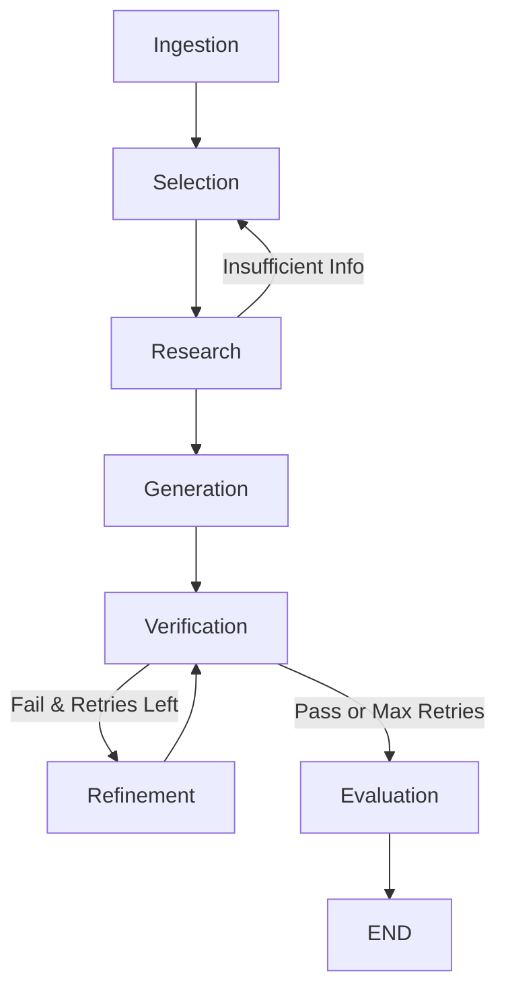

# Autonomous News Agent 

An autonomous system designed to identify trending global events, filter them for impact, and generate high-quality, fact-grounded articles without human intervention.

##  Objective
This project implements a complete news pipeline capable of:
1.  **Ingestion**: Fetching trending data via APIs, RSS, and scrapers.
2.  **Selection**: Filtering noise to identify the top 35 significant global trends.
3.  **Research**: Gathering factual context from real-time sources.
4.  **Generation**: Writing publication-ready articles (600800 words) grounded in facts.
5.  **Output**: Delivering a structured JSON payload for external consumption.

##  Quick Start (Proposed)

### Prerequisites
*   Python 3.10+
*   Docker & Docker Compose
*   API Keys (OpenAI/Anthropic, NewsAPI/SerpApi)

### Installation
```bash
git clone <repository-url>
cd NewsPipeline
pip install -r requirements.txt
```

### Configuration
Create a `.env` file in the root directory:
```env
OPENAI_API_KEY=your_key_here
SERPAPI_API_KEY=your_key_here
NEWS_API_KEY=your_key_here
```

##  Usage Guide

### 1. Traditional CLI
```bash
python3 main.py [Region]
```

### 2. Streamlit Dashboard
```bash
streamlit run src/ui/dashboard.py
```

### 3. REST API (New)
Start the server:
```bash
uvicorn src.api.main:app --reload
```
Trigger a run:
```bash
curl -X POST "http://localhost:8000/run?region=US"
```

##  Project Structure
```text
NewsPipeline/
 data/               # Output JSON and History storage
 docs/               # Detailed technical documentation
 src/
    agents/         # Selection, Generation, Verification, and Evaluation
    core/           # Graph orchestration and Data models
    services/       # Ingestion and Research services
    ui/             # Streamlit Dashboard
 main.py             # CLI Entry point
 config.yaml         # Centralized configuration
```

##  Workflow Diagram


##  Architecture Overview
For detailed information on the ranking logic, RAG implementation, and LangGraph orchestration, please refer to [TECHNICAL_DETAILS.md](docs/TECHNICAL_DETAILS.md).
